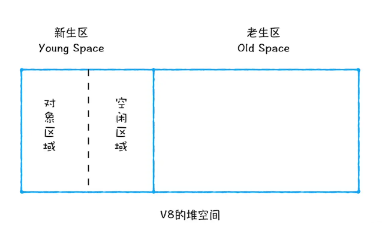
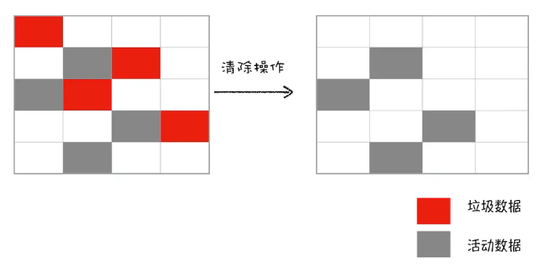
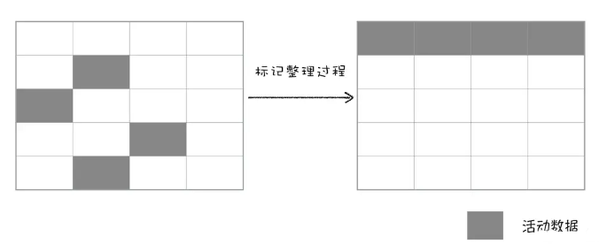

### 前言

通常情况下，垃圾回收分为 **手动回收** 和 **自动回收** 两种策略。如 C/C++ 就是使用手动回收策略，何时分配内存、何时销毁内存都是由代码控制的。另外一种使用的是自动垃圾回收的策略，如 JavaScript、Java、Python 等语言，产生的垃圾数据是由垃圾回收器来释放的，并不需要手动通过代码来释放。

### 调用栈中的数据是如何回收的？

当一个函数执行结束之后，JavaScript 引擎会通过向下移动 ESP (**记录当前执行状态的指针**)来销毁该函数保存在栈中的执行上下文。这个 **下移操作** 就是销毁执行上下文的过程。

### 堆中的数据是如何回收的？

在 V8 中会把堆分为 **新生代** 和 **老生代** 两个区域，新生代中存放的是 **生存时间短** 的对象，老生代中存放的 生存时间久 的对象。新生区通常只支持 1 ～ 8M 的容量，而老生区支持的容量就大很多了。对于这两块区域，V8 分别使用两个不同的垃圾回收器，以便更高效地实施垃圾回收。

::: tip 
- 副垃圾回收器，主要负责新生代的垃圾回收。
- 主垃圾回收器，主要负责老生代的垃圾回收。
:::

### 垃圾回收器的工作流程

不论什么类型的垃圾回收器，它们都有一套共同的执行流程：

::: tip
1.第一步是标记空间中 **活动对象** 和 **非活动对象**。所谓活动对象就是还在使用的对象，非活动对象就是可以进行垃圾回收的对象。 
2.第二步是回收 **非活动对象** 所占据的内存。其实就是在所有的标记完成之后，统一清理内存中所有被标记为可回收的对象。 
3.第三步是做内存整理。一般来说，频繁回收对象后，内存中就会存在大量不连续空间，我们把这些不连续的内存空间称为 **内存碎片**。当内存中出现了大量的内存碎片之后，如果需要分配较大连续内存的时候，就有可能出现 **内存不足** 的情况。所以最后一步需要整理这些内存碎片，但这步其实是可选的，因为有的垃圾回收器不会产生内存碎片，比如副垃圾回收器。
:::

### 副垃圾回收器

副垃圾回收器主要负责新生区的垃圾回收。通常情况下，大多数小的对象都会被分配到新生区，所以说这个区域虽然不大，但是垃圾回收还是比较频繁的。 
新生代中用 **Scavenge** 算法来处理。所谓 **Scavenge** 算法，就是把新生代空间 **对半划分** 为两个区域，一半是 **对象区域**，一半是 **空闲区域**。新加入的对象都会存放到对象区域，当对象区域快被写满时，就需要执行一次 **垃圾清理** 操作。

在垃圾回收过程中，首先要对对象区域中的垃圾做标记。标记完成之后，就进入垃圾清理阶段，副垃圾回收器会把这些 **活动对象** 复制到空闲区域中，同时它还会把这些对象有序地排列起来，所以这个复制过程，也就相当于完成了内存整理操作，复制后空闲区域就没有内存碎片了。 
完成复制后，对象区域与空闲区域进行角色翻转，这样就完成了垃圾对象的回收操作，同时这种角色翻转的操作还能让新生代中的这两块区域无限重复使用下去。 
由于新生代中采用的 **Scavenge** 算法，所以每次执行清理操作时，都需要将存活的对象从对象区域 **复制** 到空闲区域。但复制操作需要时间成本，如果新生区空间设置得太大了，那么每次清理的时间就会过久，所以为了 **执行效率**，一般新生区的空间会被设置得比较小。也正是因为新生区的空间不大，所以很容易被存活的对象装满整个区域。为了解决这个问题，JavaScript 引擎采用了 **对象晋升策略**，也就是经过两次垃圾回收依然还存活的对象，会被移动到老生区中。

### 主垃圾回收器

主垃圾回收器主要负责老生区中的垃圾回收。除了新生区中晋升的对象，一些大的对象会直接被分配到老生区。因此老生区中的对象有两个特点，一个是对象占用空间大，另一个是对象存活时间长。 
主垃圾回收器是采用 **标记 - 清除（Mark-Sweep）** 的算法进行垃圾回收的。首先是标记过程阶段。标记阶段就是从一组根元素开始，递归遍历这组根元素，在这个遍历过程中，能到达的元素称为活动对象，没有到达的元素就可以判断为垃圾数据。接下来就是垃圾的清除过程。

不过对一块内存多次执行标记 - 清除算法后，会产生大量不连续的内存碎片。而碎片过多会导致大对象无法分配到足够的连续内存，于是又产生了另外一种算法——**标记 - 整理（Mark-Compact）**，这个标记过程仍然与标记 - 清除算法里的是一样的，但后续步骤不是直接对可回收对象进行清理，而是让所有存活的对象都向一端移动，然后直接清理掉端边界以外的内存。

### 全停顿

由于 JavaScript 是运行在主线程之上的，一旦执行垃圾回收算法，都需要将正在执行的 JavaScript 脚本暂停下来，待**垃圾回收完毕后再恢复脚本执行**。我们把这种行为叫做 **全停顿**（Stop-The-World）。 
为了降低老生代的垃圾回收而造成的卡顿，V8 将标记过程分为一个个的子标记过程，同时让垃圾回收标记和 JavaScript 应用逻辑交替进行，直到标记阶段完成，我们把这个算法称为 **增量标记（Incremental Marking）算法**。 
使用增量标记算法，可以把一个完整的垃圾回收任务拆分为很多小的任务，这些小的任务执行时间比较短，可以穿插在其他的 JavaScript 任务中间执行，这样当执行动画效果时，就不会让用户因为垃圾回收任务而感受到页面的卡顿了。

