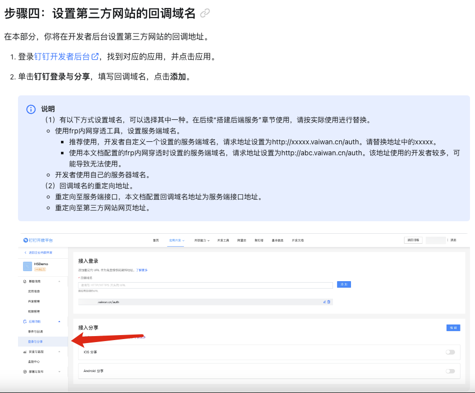

## 实现登录第三方网站

官网地址：https://open.dingtalk.com/document/orgapp/tutorial-obtaining-user-personal-informatio

### 内嵌二维码方式登录授权

#### 在public/index.html引入钉钉扫码登录JSSDK

```javascript
<script src="https://g.alicdn.com/dingding/h5-dingtalk-login/0.21.0/ddlogin.js"></script>
```

#### 需要展示二维码页面

```html
<div id="login_container" style="transform: scale(1); background: #ffffff"></div>
// id必写，style是为了调整二维码大小，二维码官方固定尺寸，只能通过缩放改变
```

#### 方法调用

```javascript
ddLoginInit() {
 
       // 扫码后页面重定向地址
       let url = encodeURIComponent("");
 
       // 应用创建完成后，在基础信息页面中的AppKey
       let appid = "";
 
       window.DTFrameLogin(
          {
              id: "login_container",
              width: "100%", // 365
              height: "300", // 400
          },
          {
              redirect_uri: url, // 授权通过/拒绝后回调地址。
              client_id: appid, // 企业内部应用：client_id为应用的AppKey。第三方企业应用：client_id为应用的SuiteKey。
              scope: "openid", // 授权范围，授权页面显示的授权信息以应用注册时配置的为准。
              response_type: "code", // 固定值为code。授权通过后返回authCode。
              state: "test", // 跟随authCode原样返回。
              prompt: "consent", // 值为consent时，会进入授权确认页。
           },
           (loginResult) => {
              const { redirectUrl, authCode, state } = loginResult;
              console.log(redirectUrl, authCode);
              // 这里可以直接进行重定向
              window.location.href = redirectUrl;
              // 也可以在不跳转页面的情况下，使用code进行授权
           },
           (errorMsg) => {
              console.log(errorMsg);
              // 这里一般需要展示登录失败的具体原因
           }
     );
}
```

### 重定向地址需要联系管理员配置

<br>

### 扫码

1. 点击同意后，触发请求步骤四设置的第三方网站的回调域名，钉钉在url返回authCode。
   <br>
2. 根据authCode，调用服务端获取用户token接口，获取用户个人token。
