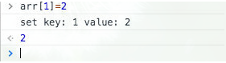

## Vue2.0为什么不能检查数组的变化？又该如何解决？

- 无法检测数组/对象的新增
- 无法检测通过索引改变数组的操作

### 分析

- 无法检测数组/对象的新增？
::: tip
Vue检测数据的变动是通过Object.defineProperty实现的，所以无法监听数组的添加操作是可以理解的，因为是在构造函数中就已经为所有属性做了这个检测绑定操作。
:::

- 无法检测通过索引改变数组的操作。即vm.items[indexOfItem] = newValue？
::: tip
[官方文档](https://v2.cn.vuejs.org/v2/guide/list.html#%E6%B3%A8%E6%84%8F%E4%BA%8B%E9%A1%B9)中对于这两点都是简要的概括为“由于JavaScript的限制”无法实现，而Object.defineProperty是实现检测数据改变的方案，那这个限制是指Object.defineProperty吗？
:::

### 思考

**vm.items[indexOfItem] = newValue真的不能被监听么？**

::: tip
Vue对数组的7个变异方法（push、pop、shift、unshift、splice、sort、reverse）实现了响应式。这里就不做测试了。我们测试一下通过索引改变数组的操作，能不能被监听到。<br>
遍历数组，用Object.defineProperty对每一项进行监测
:::

```JS
function defineReactive(data, key, value) {
	 Object.defineProperty(data, key, {
		 enumerable: true,
		 configurable: true,
		 get: function defineGet() {
			 console.log(`get key: ${key} value: ${value}`)
			 return value
		 },
		 set: function defineSet(newVal) {
			 console.log(`set key: ${key} value: ${newVal}`)
			 value = newVal
		 }
	 })
}
 
function observe(data) {
	Object.keys(data).forEach(function(key) {
		defineReactive(data, key, data[key])
	})
}
 
let arr = [1, 2, 3]
observe(arr)
```



### 测试说明

::: tip
通过索引改变arr[1]，我们发现触发了set，也就是Object.defineProperty是可以检测到通过索引改变数组的操作的，那Vue2.0为什么没有实现呢？是尤大能力不行？这肯定毋庸置疑。那他为什么不实现呢？
:::

### 原因

::: tip
对于对象而言，每一次的数据变更都会对对象的属性进行一次枚举，一般对象本身的属性数量有限，所以对于遍历枚举等方式产生的性能损耗可以忽略不计，但是对于数组而言呢？数组包含的元素量是可能达到成千上万，假设对于每一次数组元素的更新都触发了枚举/遍历，其带来的性能损耗将与获得的用户体验不成正比，故vue无法检测数组的变动。
:::

### 解决方案

#### 数组

1.this.$set(array, index, data)

```JS
// 这是个深度的修改，某些情况下可能导致你不希望的结果，因此最好还是慎用
this.dataArr = this.originArr
this.$set(this.dataArr, 0, {data: '修改第一个元素'})
console.log(this.dataArr)        
console.log(this.originArr)  // 同样的 源数组也会被修改 在某些情况下会导致你不希望的结果 
```

2.splice

```JS
// 因为splice会被监听有响应式，而splice又可以做到增删改。
```

3.利用临时变量进行中转

```JS
let tempArr = [...this.targetArr]
tempArr[0] = {data: 'test'}
this.targetArr = tempArr
```

#### 对象

1.this.$set(obj, key ,value) - 可实现增、改<br>
2.watch时添加deep：true深度监听，只能监听到属性值的变化，新增、删除属性无法监听

```JS
this.$watch('blog', this.getCatalog, {
    deep: true
    // immediate: true // 是否第一次触发
});
```

3.watch时直接监听某个key

```JS
watch: {
  'obj.name'(curVal, oldVal) {
    // TODO
  }
}
```

## 详细分析不能监听的情况

### 一、数组

1.直接通过下标赋值  

```JS
arr[i] = value
```

2.直接修改数组长度 

```JS
arr.length = newLen
```

#### 解决方法

```JS
// 修改值:
1.Vue.set(arr, index, newValue)
2.vm.$set(arr, index, newValue)
3.arr.splice(index, 1, newValue)

// 修改数组长度:
1.arr.splice(newLen)
```

#### 注意

调用数组的pop、push、shift、unshift、splice、sort、reverse等方法时是可以监听到数组的变化的vue内部相当于重写了数组的原型，劫持了这七个方法

### 二、对象

1.属性的新增和删除

```JS
obj.newKey=newValue
delete obj.key
```

#### 解决方法

```JS
// 新增:
1. Vue.set(obj, newKey, newValue)
2. vm.$set(obj, newKey, newValue)
3. obj = Object.assign({}, obj, {newKey1: newValue1, newKey2: newValue2})

// 删除:
1. Vue.delete(obj, key)
2. vm.$delete(obj, key)
```

### 分析原因

    首先，vue2是通过Object.defineProperty(obj, key, value)这种方式监听数据的

    1. 对于数组
    Object.defineProperty()是可以对数组实现监听操作的，但是vue并没有实现这个功能，因为数组长度不定而且数据可能会很多，如果对每一个数据都实现监听，性能代价太大
    但是注意：数组中的元素是引用类型时是会被监听的

    2. 对象
    Object.defineProperty()针对的是对象的某个属性，而且这个操作在vue的初始化阶段就完成了，所以新增的属性无法监听，通过set方法新增对象就相当于初始化阶段的数据响应式处理
    vue 3是通过proxy直接代理整个对象来实现的，而不是像Object.defineProperty针对某个属性。所以，只需做一层代理就可以监听同级结构下的所有属性变化，包括新增属性和删除属性