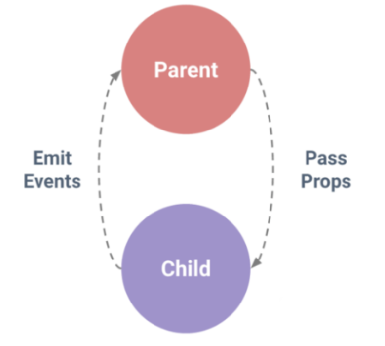

## 概述
在Vue的框架开发的项目过程中，经常会用到组件来管理不同的功能，有一些公共的组件会被提取出来。这时必然会产生一些疑问和需求？比如一个组件调用另一个组件作为自己的子组件，那么我们如何进行给子组件进行传值呢？如果是电商网站系统的开发，还会涉及到购物车的选项，这时候就会涉及到非父子组件传值的情况。

#### Vue 开发中常见的三种数据传递情况：父传子、子传父、非父子组件间值的传递



## 父组件向子组件传值

父组件先通过 **v-bind** 绑定一个数据，然后子组件通过 **defineProps宏** 接收传递过来的值。如下代码：<br>
父组件 App.vue 中传递 type 和 loading 两个属性值给子组件 Ogbutton

```vue
<script setup>
    import OgButton from "@c/ogbutton/Ogbutton.vue"
    import { reactive } from "vue"
    let state = reactive({
        loading: false
    })
</script>

<template>
   <og-button type="warning" :loading="state.loading">Warning</og-button>
   <og-button :type="'success'">Success</og-button>
</template>
```

子组件 OgButton.vue 中通过 **defineProps宏(宏无需引入，直接使用即可)** 接收传递过来的值

```vue
<script setup>
import { computed, toRefs } from "vue"
const props = defineProps({
    type: {
        type: String,
        default: "default"
    },
    loading: {
        type: Boolean,
        default: false
    }
})

const { type,loading } = toRefs(props);
const btnType = computed(() => {
    return type.value ? `btn-${type.value}` : ""
})
</script>

<template>
    <button class="btn" :class="btnType">
        <i class="iconfont icon-loading" v-if="loading" style="margin-right:6px"></i>
    </button>
</template>
```

::: tip
注：vue 设计是单向数据流，数据的流动方向只能是自上往下。为了防止从子组件意外变更父组件的状态，导致应用的数据流向难以理解，规定子组件中不能修改父组件中的数据。
:::

## 子组件向父组件传值

子组件通过 **defineEmits宏** 派发一个事件，并返回一个函数<br>
template 模板中直接使用 $emit() 触发这个事件，script 模块中通过defineEmits宏返回的函数触发这个事件<br>

两个触发事件的函数参数：
- 第一个参数为自定义的事件名称
- 第二个参数为需要传递的数据

```vue
<script setup>
    const emits = defineEmits(['formSubmit', 'formBack'])
    const submitForm = (formEle) => {
        console.log(formEle)
        if (!formEle) return
        emits('formSubmit', formEle)
    }
    const resetForm = (formEle) => {
        if (!formEle) return
        formEle.resetFields()
    }
    const backFn = () => {
        // history.back()
        emits('formBack','返回操作传递的数据....')
    }
</script>

<template>
    <div>
        <el-form ref="formRef" scroll-to-error>
        	<el-form-item>
            	...省略表单控件渲染代码
            </el-form-item>

            <el-form-item class="btns">
                <el-button type="primary" @click="submitForm(formRef)">提交</el-button>
                <el-button type="warning" @click="resetForm(formRef)">重置</el-button>
                <el-button type="danger" @click="backFn">返回</el-button>
            </el-form-item>
        </el-form>
    </div>
</template>
```

父组件监听子组件中定义的事件，并接收传递过来的数据

```vue
<script setup>
	import OgForm from "@c/ogform/Ogform.vue"

	const submit = (formEle) => {
	    formEle.validate((valid, fields) => {
	        ....省略代码
	    })
	}
	
	const back = (arg) => {
	    ....省略代码
	}
</script>

<template>
    <div>
        <og-form  @form-submit="submit" @form-back="back"></og-form>
    </div>
</template>
```

## 子组件暴露内部属性给父组件

用了 <**script setup**> 的组件是默认私有的：一个父组件无法访问到一个使用了 <**script setup**> 的子组件中的任何东西，除非子组件在其中通过 defineExpose 编译器宏显式暴露。<br>

Child.vue 子组件通过 **defineExpose宏** 暴露私有属性：

```vue
<script setup>
    import { ref } from 'vue'

    const a = 1
    const b = ref(2)

    defineExpose({
      a,
      b
    })
</script>
```

父组件 ref 模板引用：

```vue
<script setup>
    import { ref, onMounted } from 'vue'
    import Child from './Child.vue'

    const child = ref(null)

    onMounted(() => {
      console.log(child.value)
    })
</script>

<template>
  <Child ref="child" />
</template>
```