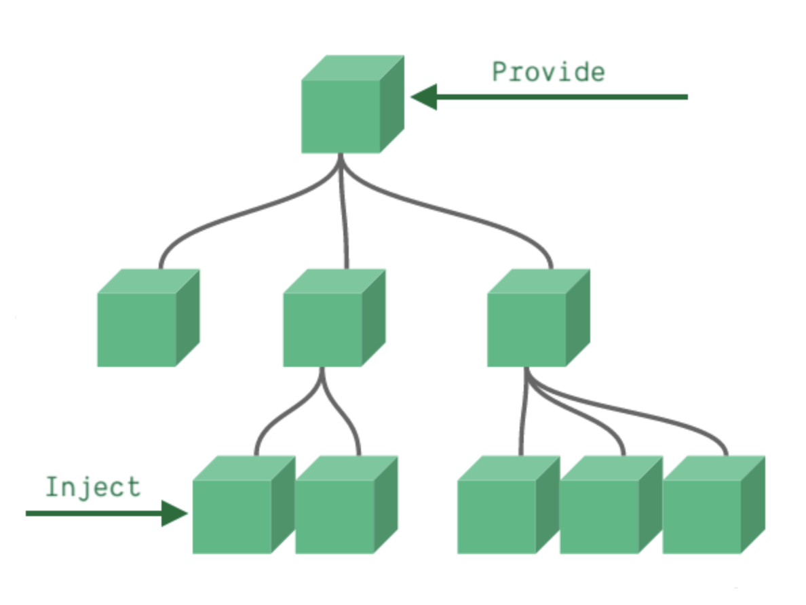

## 依赖注入 Provide/Inject

通常，当我们需要从父组件向子组件传递数据时，我们使用 props。想象一下这样的结构：有一些深度嵌套的组件，而深层的子组件只需要父组件的部分内容。在这种情况下，如果仍然将 prop 沿着组件链逐级传递下去，可能会很麻烦。<br>

官网的解释很让人疑惑，那我翻译下这几句话：<br>

provide 可以在祖先组件中指定我们想要提供给后代组件的数据或方法，而在任何后代组件中，我们都可以使用 **inject** 来接收 provide 提供的数据或方法。<br>



**父组件传递数据**

```vue
<script setup>
    import { provide, ref } from 'vue'
    import A from './components/A.vue'
    let flag = ref(1)
    
    provide('flag', flag)
</script>

<template>
    <div class="App">
        <button>我是App</button>
        <A></A>
    </div>
</template>
```

**后代组件接收数据**

```vue
<script setup>
    import { inject, ref } from 'vue'

    const flag = inject('flag', ref(1))

    const change = () => {
        flag.value = 2
    }
</script>

<template>
    <div style="background-color: green;">
        我是B
        <button @click="change">change flag</button>
        <div>{{ flag }}</div>
    </div>
</template>
```

::: tip
**使用场景**：当父组件有很多数据需要分发给其后代组件的时候， 就可以使用provide和inject
:::