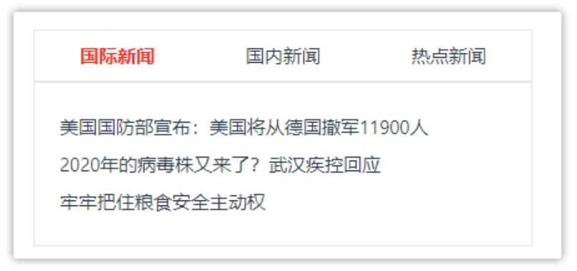

## 动态组件

通过内置组件的 is 属性，动态指定需要显示的组件<br>
动态组件实现 Tab 切换的效果<br>



演示代码：

```vue
<script setup>
import Tab1 from '../components/tabs/Tab1.vue';
import Tab2 from '../components/tabs/Tab2.vue';
import Tab3 from '../components/tabs/Tab3.vue';
import { ref, shallowRef, markRaw, reactive } from "vue"

// let cutComp = ref(Tab1)
let cutComp = shallowRef(Tab1)
let cutIdx = ref(0)
let data = reactive([{
    id: 1,
    title: "国际新闻",
    tabName: markRaw(Tab1)
}, {
    id: 2,
    title: "国内新闻",
    tabName: markRaw(Tab2)
}, {
    id: 3,
    title: "热点新闻",
    tabName: markRaw(Tab3)
}])

const toggleTab = (idx) => {
    cutIdx.value = idx
    cutComp.value = data[idx].tabName
}
</script>

<template>
    <div class="tab-wrap">
        <!-- Vue中提供了component元组件用于实现组件的动态切换，基于特殊的属性 is；可以用于切换自定义组件，也可以用于切换原生DOM，当然内置组件也是可以的 -->
        <!-- <component :is="Tab1"></component>
        <component is="input"></component> -->

        <!-- 选项卡切换 -->
        <!-- <ul>
            <li>国际新闻</li>
            <li>国内新闻</li>
            <li>热点新闻</li>
        </ul> -->
        <ul>
            <li v-for="item, index in data" :class="index == cutIdx ? 'active' : ''" @click="toggleTab(index)">{{
                item.title
            }}</li>
        </ul>
        <div class="content">
            <component :is="cutComp"></component>
        </div>
    </div>
</template>

<style lang="scss" scoped>
.tab-wrap {
    width: 300px;

    ul {
        list-style: none;
        display: flex;
        padding: 0;
        justify-content: space-between;
        border: 1px solid #e3e3e3e3;
    }

    li {
        flex: 1;
        padding: 6px 0;
        text-align: center;
        cursor: pointer;

        &.active {
            color: blue;
            font-weight: bold;
        }
    }
}

.content {
    height: 160px;
    padding: 10px;
    border: 1px solid #e7e7e7;
}
</style>
```