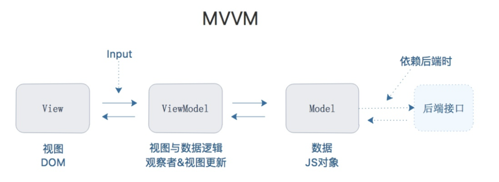
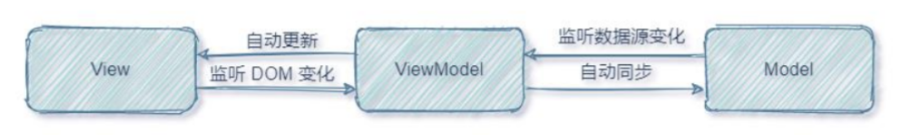

## Vue3 框架
    - vue（核心库）
    - vue-router（路由方案）
    - pinia（状态管理方案）
    - Element Plus（快速搭建页面UI 效果的方案）

## 辅助vue 项目开发的一系列工具
    - ite（npm 全局包：一键生成工程化的vue 项目-小而巧）
    - vue-devtools（浏览器插件：辅助调试的工具）
    - VSCode Vue3 插件推荐 Vue Language Features (Volar)

## 核心关键词：渐进式（自底向上）
**渐进式**：就是一步一步的拓展功能，不是说你必须一次把所有的东西都用上。<br>
**自底向上设计**：是一种设计程序的过程和方法，就是先编写出基础程序段，然后再逐步扩大规模、补充和升级某些功能，实际上是一种自底向上构造程序的过程。<br>

    在 Vue 中，保证核心功能的基础上，增加路由、状态管理、UI框架等等生态系统拓展 Vue 基础的功能，以适应指定业务场景的需求。

## 核心关键字：声明式
Vue 的两个核心功能：**声明式渲染** 和 **响应性**

    - 声明式渲染：Vue 基于标准 HTML 拓展了一套模板语法，使得我们可以声明式地描述最终输出的 HTML 和 JavaScript 状态之间的关系。
    - 响应性：Vue 会自动跟踪 JavaScript 状态并在其发生变化时响应式地更新 DOM。

**拓展**：声明式编程与命令式编程

    - 命令式编程（Imperative）：详细的命令机器怎么（How）去处理一件事情以达到你想要的结果（What）。举例前面学习JS完成案例的过程中，每完成一个操作，都需要通过JavaScript编写一条代码，来给浏览器一个指令；每一步的指令都是按顺序执行的，称为命令式编程
    - 声明式编程（ Declarative）：只告诉你想要的结果（What），机器自己摸索过程（How）。Vue 开发过程中，我们会在createApp传入的对象中声明需要的内容，模板template、数据data、方法methods；称为是声明式编程
    声明式编程对程序开发人员更加友好，让其把工作重心放在核心业务实现上。

## 核心关键字：组件化
    组件系统是 Vue 的另一个重要概念，因为它是一种抽象，允许我们使用小型、独立和通常可复用的组件构建大型应用。几乎任意类型的应用界面都可以抽象为一个组件树。

    正是因为有了组件化的思想，前端的跨平台得到了实现。所谓组件，就是对象，每一个组件都是一个 js 对象，每一个 js 对象都可以编译成 html、Android、iOS 或者桌面端上的元素。

    组件可以进行封装，实现代码复用。

界面根据Dom结构进行拆分，形成树状结构有如下优点：

    - 良好的复用性：我需要哪个组件，就把哪个组件（对应图中的每一个立方体）单拎出来用，因为组件之间是独立的。
    - 高效，便于比对：哪些数据数据变了可以立刻做出响应。界面中修改数据时，不需要层层寻找，找到对应的Dom元素再进行修改，我们可以根据组件的编号，找到相对应的组件进行数据的修改。

## MVVM 模式
MVVM 是一种数据驱动模式。即将数据和视图双向绑定，我们既可以通过修改视图来修改数据，也可以通过修改数据来修改视图。<br>
Vue 使用MVVM响应式编程模型，避免直接操作DOM , 降低DOM操作的复杂性。<br>
  
在MVVM（Model-View-ViewModel） 架构中，它把每个HTML 页面都拆分成了如下三个部分：

    - View：视图层（UI 用户界面）
    - Model：数据层（存储数据及对数据的处理如增删改查）
    - ViewModel：业务逻辑层（一切 js 可视为业务逻辑），MVVM核心

### 工作原理
ViewModel 作为MVVM 的核心，是它把当前页面的数据源（Model）和页面的结构（View）连接在了一起。<br>
   
当数据源发生变化时，会被ViewModel 监听到，VM 会根据最新的数据源自动更新页面的结构<br>
当表单元素的值发生变化时，也会被VM 监听到，VM 会把变化过后最新的值自动同步到Model 数据源中<br>

### 优点
    - 低耦合：视图（View）可以独立于Model变化和修改，一个ViewModel可以绑定到不同的View上，当View变化的时候Model可以不变，当Model变化的时候View也可以不变。
    - 可重用性：你可以把一些视图逻辑放在一个ViewModel里面，让很多view重用这段视图逻辑。
    - 独立开发：开发人员可以专注于业务逻辑和数据的开发（ViewModel），设计人员可以专注于页面设计。
    - 可测试：界面素来是比较难于测试的，而现在测试可以针对ViewModel来写。

## Vue 开发采用虚拟 DOM
用传统的开发模式，原生JS或JQ操作DOM时，浏览器会从构建DOM树开始从头到尾执行一遍流程。在一次操作中，我需要更新10个DOM节点，浏览器收到第一个DOM请求后并不知道还有9次更新操作，因此会马上执行流程，最终执行10次。例如，第一次计算完，紧接着下一个DOM更新请求，这个节点的坐标值就变了，前一次计算为无用功。计算DOM节点坐标值等都是白白浪费的性能。即使计算机硬件一直在迭代更新，操作DOM的代价仍旧是昂贵的，频繁操作还是会出现页面卡顿，影响用户体验。<br>

Web界面由DOM树(树的意思是数据结构)来构建，当其中一部分发生变化时，其实就是对应某个DOM节点发生了变化，虚拟DOM就是为了解决浏览器性能问题而被设计出来的。如前，若一次操作中有10次更新DOM的动作，虚拟DOM不会立即操作DOM，而是将这10次更新的diff内容保存到本地一个JS对象中，最终将这个JS对象一次性attch到DOM树上，再进行后续操作，避免大量无谓的计算量。所以，用JS对象模拟DOM节点的好处：页面的更新可以先全部反映在JS对象(虚拟DOM)上，操作内存中的JS对象的速度显然要更快，等更新完成后，再将最终的JS对象映射成真实的DOM，交由浏览器去绘制，从而提高性能。

##  Vue3 对比 Vue2
    Vue1.x 与 Vue2.x 的 Options APl（选项式API）的设计是按照 methods、computed、data、 props这些不同的选项分类，当组件小的时候，这种分类方式一目然;但是在大型组件中，一个组件可能有多个逻辑关注点，当使用Options APl的时候，每一个关注点都有自己的Options，如果需要修改一个逻辑点关注点，就需要在单个文件中不断上下切换和寻找。

    Vue3.x 的 Composition API（组合式API），它有一个很好的机制去解决这样的问题，就是将某个逻辑关注点相关的代码全都放在一个函数里。

## Vue3 新特性

### 重写双向数据绑定
**Vue2 基于Object.defineProperty() 实现**

把 Vue 中的核心方法 defineReactive 做一些简化如下：
```JavaScript
function defineReactive (obj, key, val, cb) {
    var dep = new Dep();
    Object.defineProperty(obj, key, {
        enumerable: true,
        configurable: true,
        get: () => {
            /*....依赖收集等....*/
            dep.depend()
            return val
        },
        set: newVal => {
            val = newVal;
            /*触发回调*/
            dep.notify()
        }
    })
}
```
::: tip
Vue通过defineReactive方法实现对需要观察的对象的每个属性进行监控。dep对象就相当于一个调度中心的作用，如果有数据用到这个属性，它就会自动收集该属性到调度中心，如果某属性发生了改变，那就会通知调度中心来更新视图。
:::
**Vue3 基于Proxy 实现**
::: tip
Proxy 与 Object.defineProperty(obj, prop, desc)方式相比有以下优势：

- 丢掉麻烦的备份数据
- 省去for in 循环
- 可以监听数组变化
- 代码更简化
- 可以监听动态新增的属性
- 可以监听删除的属性
- 可以监听数组的索引和 length 属性
:::

### 优化虚拟DOM
**在Vue2中,每次更新diff,都是全量对比,Vue3则只对比带有标记的,这样大大减少了非动态内容的对比消耗**<br>
**在Vue3中新增了 patch flag 标记**
```bash
TEXT = 1 // 动态文本节点
CLASS=1<<1,1 // 2//动态class
STYLE=1<<2，// 4 //动态style
PROPS=1<<3,// 8 //动态属性，但不包含类名和样式
FULLPR0PS=1<<4,// 16 //具有动态key属性，当key改变时，需要进行完整的diff比较。
HYDRATE_ EVENTS = 1 << 5，// 32 //带有监听事件的节点
STABLE FRAGMENT = 1 << 6, // 64 //一个不会改变子节点顺序的fragment
KEYED_ FRAGMENT = 1 << 7, // 128 //带有key属性的fragment 或部分子字节有key
UNKEYED FRAGMENT = 1<< 8, // 256 //子节点没有key 的fragment
NEED PATCH = 1 << 9, // 512 //一个节点只会进行非props比较
DYNAMIC_SLOTS = 1 << 10 // 1024 // 动态slot
HOISTED = -1 // 静态节点
BALL = -2
```
我们发现创建动态 dom 元素的时候，Vdom 除了模拟出来了它的基本信息之外，还给它加了一个标记： 1 /* TEXT */，这个标记就叫做 patch flag（补丁标记）。patch flag 的强大之处在于，当你的 diff 算法走到 _createBlock 函数的时候，会忽略所有的静态节点，只对有标记的动态节点进行对比，而且在多层的嵌套下依然有效。尽管 JavaScript 做 Vdom 的对比已经非常的快，但是 patch flag 的出现还是让 Vue3 的 Vdom 的性能得到了很大的提升，尤其是在针对大组件的时候。

### Fragments
vue3 允许我们支持多个根节点
```html
<div>Hello World</div>
<div>Hello Vue</div>
<div :key="index" v-for="item,index in [10,20,304]">{{item}}</div>
```
同时支持render JSX 写法
```jsx
render() {
    return (
        <>
            {this.visable ? (
                <div>{this.obj.name}</div>
            ) : (
                <div>{this.obj.price}</div>
            )}
            <input v-model={this.val}></input>
            {[1, 2, 3].map((v) => {
               return <div>{v}-----</div>;
            })}
        </>
    );
}
```
同时新增了Suspense teleport 和 多 v-model 用法

### Tree shaking
简单来讲，就是在保持代码运行结果不变的前提下，去除无用的代码。<br>

在Vue2中，无论我们使用什么功能，它们最终都会出现在生产代码中。主要原因是Vue实例在项目中是单例的，捆绑程序无法检测到该对象的哪些属性在代码中被使用到。而 Vue3源码引入tree shaking特性，将全局 API 进行分块。如果你不使用其某些功能，它们将不会包含在你的基础包中。就是比如你要用watch 就是import {watch} from ‘vue’ 其他的computed 没用到就不会给你打包减少体积

### Composition API
Vue3 组合式 API，提供了 Setup 语法糖式编程。例如 ref reactive watch computed toRefs 等相关知识是我们接下来要讲的重点知识。

### vue-devtools 调试工具
Vue 官方提供的vue-devtools调试工具，能够方便开发者对vue 项目进行调试与开发。Chrome 浏览器在线安装vue-devtools

    - vue 2.x 调试工具
    https://chrome.google.com/webstore/detail/vuejs-devtools/nhdogjmejiglipccpnnnanhbledajbpd

    - vue 3.x 调试工具
    https://chrome.google.com/webstore/detail/vuejs-devtools/ljjemllljcmogpfapbkkighbhhppjdbg

::: tip
注意：vue2 和vue3 的浏览器调试工具不能交叉使用！
:::