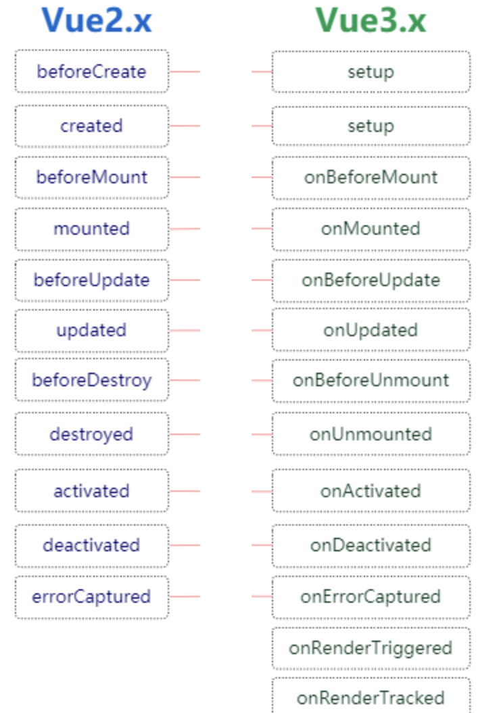

每个 Vue 组件实例在创建时都需要经历一系列的初始化步骤，比如设置好数据侦听，编译模板，挂载实例到 DOM，以及在数据改变时更新 DOM。在此过程中，它也会运行被称为生命周期钩子的函数，让开发者有机会在特定阶段运行自己的代码。



## 生命周期钩子

### 重点掌握

- **onBeforeMount()注册一个钩子，在组件被挂载之前被调用。** 
    - 当这个钩子被调用时，组件已经完成了其响应式状态的设置，但还没有创建 DOM 节点。它即将首次执行 DOM 渲染过程。

- **onMounted() 注册一个回调函数，在组件挂载完成后执行。** 组件在以下情况下被视为已挂载：
    - 其所有同步子组件都已经被挂载 (不包含异步组件或 <**Suspense**> 树内的组件)。
    - 其自身的 DOM 树已经创建完成并插入了父容器中。注意仅当根容器在文档中时，才可以保证组件 DOM 树也在文档中。

**示例：通过模板引用访问一个元素**

```vue
<script setup>
    import { ref, onMounted } from 'vue'

    const el = ref()

    onMounted(() => {
      el.value // <div>
    })
</script>

<template>
  <div ref="el"></div>
</template>
```

- **onBeforeUpdate() 注册一个钩子，在组件即将因为响应式状态变更而更新其 DOM 树之前调用。**<br>
这个钩子可以用来在 Vue 更新 DOM 之前访问 DOM 状态。在这个钩子中更改状态也是安全的。

- **onUpdated() 注册一个回调函数，在组件因为响应式状态变更而更新其 DOM 树之后调用。**
    - 这个钩子会在组件的任意 DOM 更新后被调用，这些更新可能是由不同的状态变更导致的。
    - 父组件的更新钩子将在其子组件的更新钩子之后调用。

**示例：访问更新后的 DOM**

```vue
<script setup>
    import { ref, onUpdated } from 'vue'

    const count = ref(0)

    onUpdated(() => {
      // 文本内容应该与当前的 `count.value` 一致
      console.log(document.getElementById('count').textContent)
    })
</script>

<template>
  <button id="count" @click="count++">{{ count }}</button>
</template>
```

::: tip
如果你需要在某个特定的状态更改后访问更新后的 DOM，请使用 nextTick() 作为替代。
:::

::: tip
不要在 updated 钩子中更改组件的状态，这可能会导致无限的更新循环！
:::

- **onBeforeUnmount() 注册一个钩子，在组件实例被卸载之前调用。**<br>
当这个钩子被调用时，组件实例依然还保有全部的功能。

- **onUnmounted() 注册一个回调函数，在组件实例被卸载之后调用。** 一个组件在以下情况下被视为已卸载：
    - 其所有子组件都已经被卸载。
    - 所有相关的响应式作用 (渲染作用以及 setup() 时创建的计算属性和侦听器) 都已经停止。

```vue
<script setup>
    import { onMounted, onUnmounted } from 'vue'

    let timer;
    onMounted(() => {
      timer = setInterval(() => {
        // ...
      })
    })

    onUnmounted(() => clearInterval(timer))
</script>
```

::: tip
可以在这个钩子中手动清理一些副作用，例如计时器、DOM 事件监听器或者与服务器的连接。
:::

### 需要了解

- onActivated()注册一个回调函数，若组件实例是 **KeepAlive** 缓存树的一部分，当组件被插入到 DOM 中时调用。
- onDeactivated()注册一个回调函数，若组件实例是 **KeepAlive** 缓存树的一部分，当组件从 DOM 中被移除时调用。
- onErrorCaptured() 注册一个钩子，在捕获了后代组件传递的错误时调用。错误可以从以下几个来源中捕获：
    - 组件渲染
    - 事件处理器
    - 生命周期钩子
    - setup() 函数
    - 侦听器
    - 自定义指令钩子
    - 过渡钩子

你可以在 errorCaptured() 中更改组件状态来为用户显示一个错误状态。注意不要让错误状态再次渲染导致本次错误的内容，否则组件会陷入无限循环。<br>
这个钩子可以通过返回 false 来阻止错误继续向上传递。

- onRenderTracked()注册一个调试钩子，当组件渲染过程中追踪到响应式依赖时调用(**Dev only 仅在开发模式下可用**)
- onRenderTriggered()注册一个调试钩子，当响应式依赖的变更触发了组件渲染时调用(**Dev only 仅在开发模式下可用**)
- onServerPrefetch()注册一个异步函数，在组件实例在服务器上被渲染之前调用(**SSR only 仅在服务端渲染中执行**)
    - 如果这个钩子返回了一个 Promise，服务端渲染会在渲染该组件前等待该 Promise 完成。
    - 这个钩子仅会在服务端渲染（SSR）中执行，可以用于执行一些仅存在于服务端的数据抓取过程。

```vue
<script setup>
    import { ref, onServerPrefetch, onMounted } from 'vue'

    const data = ref(null)

    onServerPrefetch(async () => {
      // 组件作为初始请求的一部分被渲染
      // 在服务器上预抓取数据，因为它比在客户端上更快。
      data.value = await fetchOnServer(/* ... */)
    })

    onMounted(async () => {
      if (!data.value) {
        // 如果数据在挂载时为空值，这意味着该组件
        // 是在客户端动态渲染的。将转而执行
        // 另一个客户端侧的抓取请求
        data.value = await fetchOnClient(/* ... */)
      }
    })
</script>
```

## 生命周期的图表

