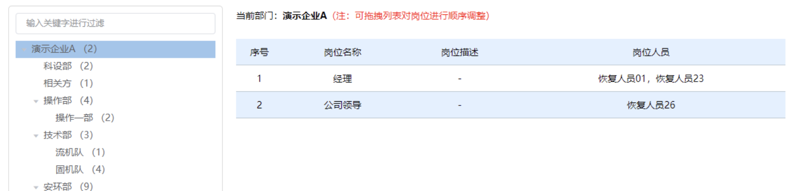

## 递归组件

递归组件类似于递归函数，就是在当前组件内调用组件本身。一般情况下，不需要 import 引入直接使用即可。



演示代码：

```vue
<script>
    export default {
        name: "MyRecursion"
    }
</script>

<script setup>
    const props = defineProps({
        obj: {
            type: Array,
            default: () => []
        }
    })

    const showItem = (title) => {
        console.log(title)
    }
</script>

<template>
    <div>
        <ul v-for="item in obj">
            <li @click="showItem(item.title)"><strong>{{ item.title }}</strong></li>
            <!-- <Tab1 v-if="item?.children?.length" :obj="item?.children" /> -->
            <MyRecursion v-if="item?.children?.length" :obj="item?.children" />
        </ul>
    </div>
</template>
```
