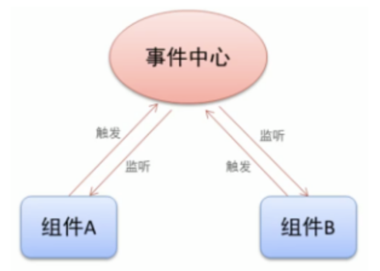

## 借助父组件传参

假设父组件 App 有两个子组件（同级组件） A 和 B：A 组件派发的事件，通过 App.vue 接收，然后通过 v-bind 传递给 B 组件。

```vue
<script setup>
    import A from './components/A.vue'
    import B from './components/B.vue'
    import { ref } from 'vue'
    let flag = ref(false)
    const getflag = (arg) => {
       flag.value = arg;
    }
</script>

<template>
    <div>
        <A @on-click="getflag"></A>
        <B :flag="flag"></B>
    </div>
</template>
```

::: tip
缺点：比较麻烦 ，无法直接通信，只能充当桥梁。
:::

## 借助 Event Bus 传参

**Vue3** 从实例中移除了 **$on**、**$off** 和 **$once** 方法，如果想要使用事件总线就需要自己手动写一个发布订阅模式来实现 **Event Bus** 。见下图：


```JS
class Bus {
    constructor() {
        this.list = { }
    }

    emit(eventName, ...args) {
        let eventFns = this.list[eventName]
        eventFns.forEach(fn => {
            fn.apply(this, args)
        })
    }

    on(eventName, callback) {
        let fnArr = this.list[eventName] || []
        fnArr.push(callback)
        this.list[eventName] = fnArr
    }

    off(eventName,callback) {
        let fnArr = this.list[eventName] || []
        if(callback){ 
            fnArr = fnArr.filter(v => v != callback)
        }else { 
            fnArr = []
        }
        this.list[eventName] = fnArr
    }
}

export default new Bus()
```

::: tip
注：将其挂载到 Vue config 全局，或者在相关的组件中引入即可使用。
:::