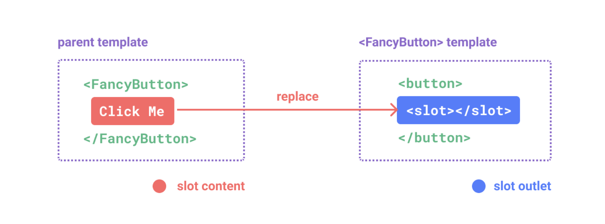
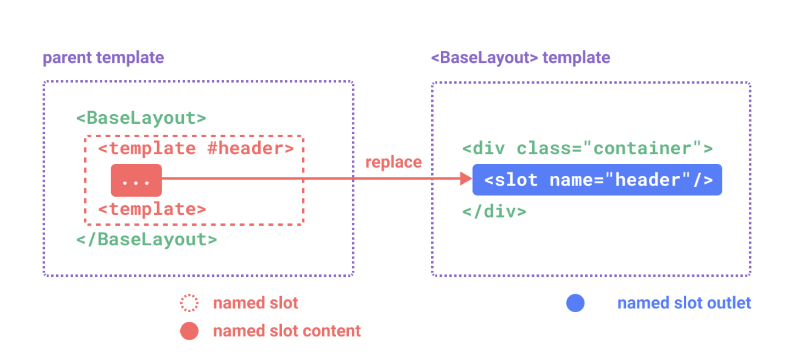
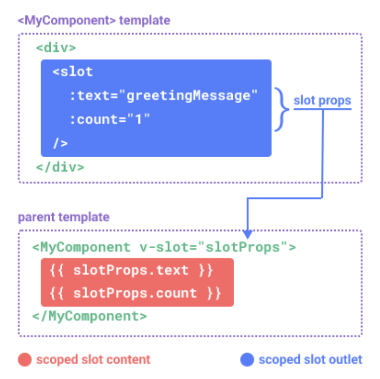

## 概述

在某些场景中，我们可能想要为子组件传递一些模板片段，让子组件在它们的组件中渲染这些片段。这就用到了插槽。<br>

插槽是子组件中的提供给父组件使用的一个占位符，用 <**slot**> 表示，父组件可以在这个占位符中填充任何模板代码，如 HTML、组件等，填充的内容会替换子组件的<**slot**> 元素。<**slot**> 元素是一个**插槽出口** (slot outlet)，标示了父元素提供的**插槽内容** (slot content) 将在哪里被渲染。



## 匿名插槽

子组件 FancyButton 中插槽模板

```vue
<!-- 基础用法 -->
<button class="fancy-btn">
	<!-- 插槽出口 -->
	<slot></slot> 
</button>

<!-- 可指定默认插槽内容：父组件没有提供任何插槽内容时，默认渲染的插槽内容 Submit -->
<button class="fancy-btn">
	<slot>Submit</slot> 
</button>
```

父组件填充插槽内容

```vue
<FancyButton>
	<!-- 插槽内容 -->
	<div>Click me!</div>
</FancyButton>

<!-- 或 -->

<FancyButton>
	<!-- 插槽内容 -->
	 <template v-slot>
       <div>Click Me</div>
    </template>
</FancyButton>
```

最终渲染出的 DOM 结构如下

```vue
<button class="fancy-btn">Click me!</button>
```

::: tip
**通过使用插槽，使组件更加灵活和具有可复用性。这样组件可以用在不同的地方渲染各异的内容，但同时还保证都具有相同的样式。**
:::

## 具名插槽 (named slots)

具名插槽其实就是给插槽取个名字。一个子组件可以放多个插槽，而且可以放在不同的地方，而父组件填充内容时，可以根据这个名字把内容填充到对应插槽中。<br>
对于这种场景，<**slot**> 元素可以有一个特殊的属性 **name**，用来给各个插槽分配唯一的 ID，以确定每一处要渲染的内容：

- 子组件预留的插槽

```vue
<div class="container">
    <header>
    	<slot name="header"></slot>
    </header>
    <main>
    	<-- 没有提供 name 的 slot 出口会隐式地命名为 “default” -->
    	<slot></slot>
    </main>
    <footer>
    	<slot name="footer"></slot>
    </footer>
</div>
```

- 父组件对指定插槽进行填充
要为具名插槽传入内容，我们需要使用一个含 **v-slot** 指令的 <**template**> 元素，并将目标插槽的名字传给该指令。

```vue
<BaseLayout>
    <template v-slot:header>
       <div>header</div>
    </template>
    <template v-slot>
       <div>default</div>
    </template>
    <template v-slot:footer>
       <div>footer</div>
    </template>
</BaseLayout>
```

- **v-slot** 语法糖（简写方式）
**v-slot** 有对应的简写 #，因此 <**template v-slot:header**> 可以简写为 <**template #header**>。其意思就是“将这部分模板片段传入子组件的 header 插槽中”。



```vue
<BaseLayout>
    <template #header>
    	<h1>Here might be a page title</h1>
    </template>

    <template #default>
    	<p>A paragraph for the main content.</p>
    	<p>And another one.</p>
    </template>

    <template #footer>
    	<p>Here's some contact info</p>
    </template>
</BaseLayout>

<!-- 或 -->

<!-- 当一个组件同时接收默认插槽和具名插槽时，所有位于顶级的非 <template> 节点都被隐式地视为默认插槽的内容。所以上面也可以写成： -->
<BaseLayout>
    <template #header>
    	<h1>Here might be a page title</h1>
    </template>

    <!-- 隐式的默认插槽 -->
    <p>A paragraph for the main content.</p>
    <p>And another one.</p>

    <template #footer>
    	<p>Here's some contact info</p>
    </template>
</BaseLayout>
```

现在 <**template**> 元素中的所有内容都将被传递到相应的插槽。最终渲染出的 HTML 如下：

```vue
<div class="container">
    <header>
    	<h1>Here might be a page title</h1>
    </header>
    
    <main>
    	<p>A paragraph for the main content.</p>
    	<p>And another one.</p>
    </main>
    
    <footer>
    	<p>Here's some contact info</p>
    </footer>
</div>
```

## 动态插槽

动态指令参数在 **v-slot** 上也是有效的，即可以通过变量定义动态插槽名：

```vue
<script setup>
	import { ref } from "vue";
	const name = ref('header')
</script>

<template>
	<base-layout>
		<template v-slot:[name]>
            <div>动态插槽</div>
        </template>
	
		 <!-- 缩写为 -->
        <template #[name]>
            <div>动态插槽</div>
        </template>
    </base-layout>
</template>
```

## 作用域插槽

在某些场景下插槽的内容可能想要同时使用父组件域内和子组件域内的数据。可以使用属性绑定的方式向一个插槽的出口上传递数据，称为插槽 props 。

### 匿名插槽数据传递

子组件 **MyComponent** 传递插槽 **props**

```vue
<div>
  <slot :text="greetingMessage" :count="1"></slot>
</div>  
```

父组件接收插槽 props：默认插槽通过子组件标签上的 **v-slot** 指令，直接接收到了一个插槽 props 对象

```vue
<MyComponent v-slot="slotProps">
	{{ slotProps.text }} {{ slotProps.count }}
</MyComponent>

<!-- 或 在 v-slot 中使用解构语法 -->
<MyComponent v-slot="{ text, count }">
	{{ text }} {{ count }}
</MyComponent>
```



### 具名插槽数据传递

具名作用域插槽的工作方式也是类似的，插槽 props 可以作为 **v-slot** 指令的值被访问到：**v-slot:name="slotProps"**。

```vue
<slot name="header" message="hello"></slot>
```

```vue
<MyComponent>
  <template #header="headerProps">
    {{ headerProps }}
  </template>

  <template #default="defaultProps">
    {{ defaultProps }}
  </template>

  <template #footer="footerProps">
    {{ footerProps }}
  </template>
</MyComponent>
```

### 作用域插槽应用场景：高级列表组件示例

你可能想问什么样的场景才适合用到作用域插槽，这里我们来看一个 <**FancyList**> 组件的例子。它会渲染一个列表，并同时会封装一些加载远端数据的逻辑、使用数据进行列表渲染、或者是像分页或无限滚动这样更进阶的功能。然而我们希望它能够保留足够的灵活性，将对单个列表元素内容和样式的控制权留给使用它的父组件。我们期望的用法可能是这样的：

```vue
<FancyList :api-url="url" :per-page="10">
    <template #item="{ body, username, likes }">
        <div class="item">
          <p>{{ body }}</p>
          <p>by {{ username }} | {{ likes }} likes</p>
        </div>
    </template>
</FancyList>
```

在 <**FancyList**> 之中，我们可以多次渲染 <**slot**> 并每次都提供不同的数据 (注意我们这里使用了 v-bind 来传递插槽的 props)：

```vue
<ul>
  <li v-for="item in items">
    <slot name="item" v-bind="item"></slot>
  </li>
</ul>
```

上面的 <**FancyList**> 案例同时封装了可重用的逻辑 (数据获取、分页等) 和视图输出，但也将部分视图输出通过作用域插槽交给了消费者组件来管理。<br>
如果我们将这个概念拓展一下，可以想象的是，一些组件可能只包括了逻辑而不需要自己渲染内容，视图输出通过作用域插槽全权交给了消费者组件。我们将这种类型的组件称为无渲染组件。<br>
这里有一个无渲染组件的例子，一个封装了追踪当前鼠标位置逻辑的组件：<br>

```vue
<MouseTracker v-slot="{ x, y }">
	Mouse is at: {{ x }}, {{ y }}
</MouseTracker>
```

虽然这个模式很有趣，但大部分能用无渲染组件实现的功能都可以通过组合式 API 以另一种更高效的方式实现，并且还不会带来额外组件嵌套的开销。<br>
尽管如此，作用域插槽在需要同时封装逻辑、组合视图界面时还是很有用，就像上面的 <**FancyList**> 组件那样。