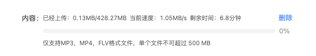

## 下载进度方法函数封装

话不多说直接上图上代码



```vue
<template>
  <div class="upload_Progress">
    <div class="upload_Progress_title">
      <div class="upload_Progress_title_left">
        <span>已经上传：{{ schedule }}</span>
        <span style="margin: 0 0 0 6px">当前速度：{{ speed }}</span>
        <span style="margin: 0 0 0 6px">剩余时间：{{ minute }}</span>
      </div>
      <div class="upload_Progress_title_right">
        <a-button type="link" @click="handleDelete">删除</a-button>
      </div>
    </div>
    <div class="upload_Progress_content">
      <a-progress :percent="percent" status="active" />
    </div>
    <div class="upload_Progress_descriptions">
      {{ fileSize }}
    </div>
  </div>
</template>

<script>
import axios from "axios";
import { CancelToken } from "axios";
export default {
  name: "uploadProgress",
  props: {
    // 文件大小
    fileSize: {
      type: String,
      default: "仅支持MP3，MP4，FLV格式文件，单个文件不可超过 500 MB",
    },
  },
  data() {
    return {
      schedule: "0MB/0MB",
      speed: "0MB/s",
      minute: "0分钟",
      percent: 0,
      source: null,
    };
  },
  methods: {
    handleUpload(formData) {
      this.source = CancelToken.source();
      let startTime = new Date().getTime();
      const config = {
        cancelToken: this.source.token,
        onUploadProgress: (progressEvent) => {
          // 计算进度
          this.percent = Number(((progressEvent.loaded / progressEvent.total) * 100).toFixed(1));
          // 计算大小
          this.schedule = (progressEvent.loaded / 1024 / 1024).toFixed(2) + "MB/" + (progressEvent.total / 1024 / 1024).toFixed(2) + "MB";
          // 计算速度
          let uploadedMB = progressEvent.loaded / 1024 / 1024;
          let totalMB = progressEvent.total / 1024 / 1024;
          let currentTime = new Date().getTime();
          let speedTime = (currentTime - startTime) / 1000; // 转换为秒
          let uploadSpeed = uploadedMB / speedTime;
          this.speed = uploadSpeed.toFixed(2) + "MB/s";
          // 计算时间
          let time = (totalMB / uploadSpeed.toFixed(2) - speedTime).toFixed(1);
          if (uploadedMB === totalMB) {
            this.minute = 0 + "秒";
          } else if (time > 60) {
            this.minute = (time / 60).toFixed(1) + "分钟";
          } else if (time <= 60) {
            this.minute = time + "秒";
          }
        },
      };
      axios.post(window._CONFIG["domianURL"] + "oss/upload", formData, config).then((res) => {
        if (res.data.success) {
          this.speed = "0MB/s";
          this.$message.success("文件上传成功");
          this.$emit("success", { url: res.data.result.originalUrl, id: res.data.result.id });
        } else {
          this.$message.error(res.data.message);
        }
      });
    },
    // 删除按钮
    handleDelete() {
      this.$nextTick(() => {
        this.source.cancel("请求被取消");
        this.$emit("handleDelete");
      });
    },
  },
};
</script>

<style lang="less" scoped>
.upload_Progress {
  width: 100%;
  font-size: 12px;
  .upload_Progress_title {
    width: 100%;
    display: flex;
    align-items: center;
    justify-content: space-between;
  }
  .upload_Progress_content {
    margin: -14px 0 0 0;
  }
  .upload_Progress_descriptions {
    line-height: 10px;
  }
}
::v-deep {
  .ant-btn {
    padding: 0;
    margin: 0 0 0 6px;
  }
}
</style>
```
