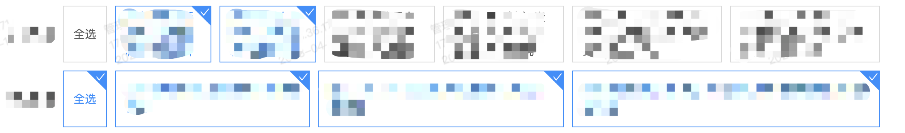

## checkbox封装

先来看看效果图



目前 **element** 和 **ant design** 并没有这种文字在里面的 **Checkbox**，所以针对这类需求简单的封装了一下样式和使用方法，代码如下

```vue
<!-- 这是checkbox样式封装代码 -->
<template>
  <div class="checkbox">
    <div :class="['checkbox_normal', { checkbox_active: flag }]" @click="handleClick">
      {{ label }}
      <div class="checkbox_delta" v-if="flag"></div>
      <div class="checkbox_check" v-if="flag">
        <a-icon type="check" style="color: #fff; font-size: 12px" />
      </div>
    </div>
  </div>
</template>

<script>
export default {
  props: {
    value: {
      type: [String, Number, Boolean],
      default: '',
    },
    label: {
      type: String,
      default: '',
    },
    name: {
      type: String,
      default: '',
    },
  },
  data() {
    return {
      flag: false,
    }
  },
  watch: {
    value: {
      immutable: true,
      deep: true,
      handler(newVal) {
        this.flag = newVal
      },
    },
  },
  methods: {
    handleClick() {
      this.flag = !this.flag
      this.$emit('input', this.flag)
      this.$emit('handleClick', {
        label: this.label,
        value: this.flag,
        name: this.name,
      })
    },
  },
}
</script>

<style lang="less" scoped>
.checkbox {
  display: flex;
  align-items: center;
  justify-content: center;
  margin: 0 10px 0 0;
  .checkbox_normal {
    display: flex;
    align-items: center;
    justify-content: flex-start;
    box-sizing: border-box;
    padding: 4px 12px;
    color: rgba(0, 0, 0, 0.65);
    background: #fff;
    border: 1px solid #d9d9d9;
    cursor: pointer;
    user-select: none;
    height: 70px;
  }
  .checkbox_active {
    border: 1px solid #1890ff;
    color: #1890ff;
    position: relative;
    overflow: hidden;
    .checkbox_delta {
      position: absolute;
      top: -8px;
      right: -14px;
      width: 35px;
      height: 23px;
      rotate: 45deg;
      background-color: #1890ff;
      overflow: hidden;
    }
    .checkbox_check {
      i {
        position: absolute;
        top: 1px;
        right: 1px;
      }
    }
  }
}
</style>
```

使用方法如下所示

```vue
<!-- 在页面中使用方法 -->
<template>
    <div class="select">
        <div class="select_box">
            <div class="select_title">checkbox</div>
            <div class="select_checkout">
                <Checkbox 
                    ref="Checkbox" 
                    name="checkbox" 
                    label="全选" 
                    v-model="value" 
                    @handleClick="handleClickAll" 
                />
                <Checkbox
                    ref="Checkbox"
                    :name="item.name"
                    :label="item.label"
                    v-model="item.value"
                    v-for="(item, index) in checkboxList"
                    :key="index"
                    @handleClick="handleClick"
                />
            </div>
        </div>
    </div>
</template>

<script>
import Checkbox from '@/components/Checkout.vue'
export default {
  components: {
    Checkbox,
  },
  data() {
    return {
      value: false,
      checkboxList: [
        {
          label: '第一个',
          value: false,
          name: 'checkbox',
        },
        {
          label: '第二个',
          value: false,
          name: 'checkbox',
        },
        {
          label: '第三个',
          value: false,
          name: 'checkbox',
        },
      ],
    }
  },
  computed: {
    valueAll() {
      return this.checkboxList.findIndex((item) => item.value !== true) === -1
    },
  },
  methods: {
    handleClickAll() {
      this.checkboxList.forEach((item) => {
        item.value = this.value
      })
    },
    handleClick(data) {
      this.value = this.valueAll
      this.checkboxList.forEach((item) => {
        if (item.label === data.label) item.value = data.value
      })
    },
  },
}
</script>
```

::: tip
注意这里的全选要和后面的选项分开来写，容易判断
:::
