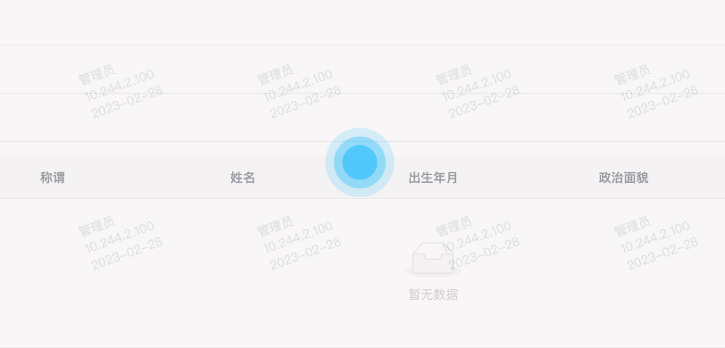

## 好看实用的loading

咱先来看看动态loading的效果



### 创建文件

一般来说，在components下新建一个loading文件夹，里面有一个js文件和一个vue文件用来写loading的样式

```vue
<!-- loading的样式文件 -->
<template>
  <transition name="el-fade-in-linear">
    <div v-show="visible">
      <div class="loading la-3x">
        <div></div>
        <div></div>
        <div></div>
      </div>
      <div class="mask"></div>
    </div>
  </transition>
</template>

<script>
export default {
  data() {
    return {
      visible: false,
    };
  },
};
</script>

<style lang="less" scoped>
.mask {
  width: 100%;
  height: 100%;
  position: absolute;
  top: 50%;
  left: 50%;
  transform: translate(-50%, -50%);
  background: rgba(239, 235, 235, 0.4);
  z-index: 1;
}
.loading,
.loading > div {
  position: relative;
  box-sizing: border-box;
}

.loading {
  z-index: 2;
  display: block;
  font-size: 0;
  color: rgb(2, 188, 254);
  // color: pink;
  position: absolute;
  top: 50%;
  left: 50%;
  transform: translate(-50%, -50%);
}

.loading.la-dark {
  color: rgb(2, 188, 254);
  // color: pink;
}

.loading > div {
  display: inline-block;
  float: none;
  background-color: currentColor;
  border: 0 solid currentColor;
}

.loading {
  width: 32px;
  height: 32px;
}

.loading > div {
  position: absolute;
  top: 0;
  left: 0;
  width: 32px;
  height: 32px;
  border-radius: 100%;
  opacity: 0;
  animation: ball-scale-multiple 1s 0s linear infinite;
}

.loading > div:nth-child(2) {
  animation-delay: 0.2s;
}

.loading > div:nth-child(3) {
  animation-delay: 0.4s;
}

.loading.la-sm {
  width: 16px;
  height: 16px;
}

.loading.la-sm > div {
  width: 16px;
  height: 16px;
}

.loading.la-2x {
  width: 64px;
  height: 64px;
}

.loading.la-2x > div {
  width: 64px;
  height: 64px;
}

.loading.la-3x {
  width: 96px;
  height: 96px;
}

.loading.la-3x > div {
  width: 96px;
  height: 96px;
}

@keyframes ball-scale-multiple {
  0% {
    opacity: 0;
    transform: scale(0);
  }

  5% {
    opacity: 0.75;
  }

  100% {
    opacity: 0;
    transform: scale(1);
  }
}
</style>
```

```JS
// loading的js文件
import Vue from "vue";
import Loading from "./index.vue";

const Mask = Vue.extend(Loading);
const toggleLoading = (el, binding) => {
  if (binding.value) {
    Vue.nextTick(() => {
      // 控制loading组件显示
      el.instance.visible = true;
      el.style.position = "relative";
      // 插入到目标元素
      insertDom(el, el, binding);
    });
  } else {
    el.instance.visible = false;
  }
};

const insertDom = (parent, el) => {
  parent.appendChild(el.mask);
};

export default {
  // bind：只调用一次，指令第一次绑定到元素时调用。在这里可以进行一次性的初始化设置。
  bind: function (el, binding, vnode) {
    // new Mask()的时候，把该组件实例挂载到一个div上
    const mask = new Mask({
      el: document.createElement("div"),
      data() {
        return {};
      },
    });
    el.instance = mask;
    el.mask = mask.$el;
    // console.log(mask);
    binding.value && toggleLoading(el, binding);
  },
  update: function (el, binding) {
    if (binding.oldValue !== binding.value) {
      toggleLoading(el, binding);
    }
  },
  unbind: function (el, binding) {
    el.instance && el.instance.$destroy();
  },
};
```

然后我们在src下新建一个directive文件夹用来存放项目中新增的一些功能

```JS
import Vue from 'vue'
import loading from '@/components/Loading/index.js'
export default {}
Vue.use({
  install(Vue) {
    Vue.directive('baseLoading', loading)
  },
})
```

### 在main.js文件中引入

```JS
import '@/directive/index.js' // loading
```

### 使用 

```html
// 使用的方法就是在我们需要加loading的盒子上面写上我们设置的名字v-baseLoading
<div v-baseLoading='loading'></div>

// 然后就是操控loading参数的true和false即可
```

### 附加antd vue上的loading样式
```vue
<!-- loading的样式文件 -->
<template>
  <div v-show="visible">
    <div class="loading">
      <div></div>
      <div></div>
      <div></div>
      <div></div>
    </div>
    <div class="mask"></div>
  </div>
</template>

<script>
export default {
  data() {
    return {
      visible: false,
    }
  },
}
</script>

<style lang="less" scoped>
.mask {
  width: 100%;
  height: 100%;
  position: absolute;
  top: 50%;
  left: 50%;
  transform: translate(-50%, -50%);
  background: rgba(239, 235, 235, 0.2);
  z-index: 1;
}
.loading {
  z-index: 9;
  display: block;
  font-size: 0;
  color: rgb(2, 188, 254);
  // color: pink;
  position: absolute;
  top: 50%;
  left: 50%;
  width: 28px;
  height: 28px;
  transform: rotate(45deg);
  -webkit-animation: antRotate 1.2s linear infinite;
  animation: antRotate 1.2s linear infinite;
}
.loading > div {
  float: none;
  border: 0 solid currentColor;
  position: absolute;
  display: block;
  width: 12px;
  height: 12px;
  background-color: #1890ff;
  border-radius: 100%;
  transform: scale(0.75);
  transform-origin: 50% 50%;
  opacity: 0.3;
  -webkit-animation: antSpinMove 1s linear infinite alternate;
  animation: antSpinMove 1s linear infinite alternate;
}
.loading > div:nth-child(1) {
  top: 0;
  left: 0;
}
.loading > div:nth-child(2) {
  top: 0;
  right: 0;
  -webkit-animation-delay: 0.4s;
  animation-delay: 0.4s;
}
.loading > div:nth-child(3) {
  right: 0;
  bottom: 0;
  -webkit-animation-delay: 0.8s;
  animation-delay: 0.8s;
}
.loading > div:nth-child(4) {
  bottom: 0;
  left: 0;
  -webkit-animation-delay: 1.2s;
  animation-delay: 1.2s;
}
@keyframes antSpinMove {
  0% {
    opacity: 0.2;
  }
  100% {
    opacity: 1;
  }
}
@keyframes antRotate {
  0% {
    transform: rotate(0deg);
  }
  100% {
    transform: rotate(360deg);
  }
}
</style>
```