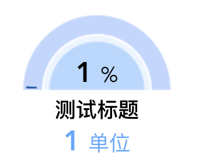

## 半圆仪表盘的封装

之前遇到过需要半圆仪表盘echarts的需求，可是看了很多官方文档都不支持半圆的处理，于是自己动手利用**svg**花了一下午简单的封装了一个。话不多说，代码如下：

::: tip
其中仪表盘的背景是一个背景图，看自己需求让ui出
:::



```vue
<template>
    <div id="progress">
        <div class="progress-now">
            <svg>
                <circle
                    cx="130"
                    cy="64"
                    r="55"
                    stroke="transparent"
                    stroke-width="9"
                    fill="none"
                    stroke-dasharray="173"
                    stroke-dashoffset="-173"
                />
                <circle
                    cx="130"
                    cy="64"
                    r="55"
                    stroke="gold"
                    stroke-width="9"
                    fill="none"
                    :stroke-dasharray="percentageComputed + ' 173'"
                    stroke-dashoffset="-173"
                />
            </svg>
        </div>
        <div class="progress-bg">
            
        </div>
        <div class="progress-box">
            <div class="progress-percent" v-if="progressPercent !== ''">
                {{ progressPercent }}
                <span>%</span>
            </div>
            <div class="progress-text">{{ progressText }}</div>
            <div class="progress-num">
                {{ progressNum }}
                <span>{{ progressCompany }}</span>
            </div>
        </div>
        <svg width="100%" height="100%">
            <defs>
                <linearGradient id="colors" x1="0%" y1="0%" x2="100%" y2="0%">
                    <stop
                        offset="0%"
                        style="stop-color: #155ea9"
                        stop-opacity="1"
                    ></stop>
                    <stop
                        offset="100%"
                        style="stop-color: #89bfee"
                        stop-opacity="1"
                    ></stop>
                </linearGradient>
            </defs>
        </svg>
    </div>
</template>

<script>
export default {
    props: {
        percentage: {
            type: [String, Number],
            default: 0,
            required: true
        },
        progressText: {
            type: String,
            default: ""
        },
        progressNum: {
            type: [String, Number],
            default: 0
        },
        progressPercent: {
            type: [String, Number],
            default: ""
        },
        progressCompany: {
            type: String,
            default: "条"
        }
    },
    data() {
        return {};
    },
    components: {},
    computed: {
        percentageComputed() {
            return ((this.percentage * 173) / 100).newFixed(1);
        }
    },
    mounted() {},
    methods: {}
};
</script>

<style lang="scss" scoped>
#progress {
    position: relative;
    width: 160px;
    height: 150px;
    .progress-now {
        position: absolute;
        top: -2px;
        left: -56px;
        z-index: 2;
        circle:nth-of-type(2) {
            stroke: url(#colors);
        }
    }
    .progress-box {
        position: absolute;
        top: 36px;
        left: -5px;
        display: flex;
        flex-direction: column;
        align-items: center;
        .progress-text {
            width: 160px;
            text-align: center;
            font-size: 18px;
            font-weight: 500;
            color: #000;
            margin: 2px 0 0 0;
            display: -webkit-box;
            -webkit-box-orient: vertical;
            -webkit-line-clamp: 2;
            overflow: hidden;
        }
        .progress-percent {
            margin: -4px 0 0 0;
            width: 110px;
            text-align: center;
            font-size: 24px;
            font-weight: bold;
            color: #000;
            span {
                font-size: 18px;
                font-weight: normal;
            }
        }
        .progress-num {
            width: 110px;
            text-align: center;
            font-size: 24px;
            font-weight: bold;
            color: #55a9ff;
            margin: -2px 0 0 0;
            span {
                font-size: 18px;
                font-weight: normal;
            }
        }
    }
    .progress-bg {
        width: 128px;
        height: 58px;
        position: absolute;
        top: -1px;
        left: 11px;
    }
}
</style>
```

页面中使用：

```vue
<template>
    <div class="progressTest">
        <progressTest
            :percentage="1"
            progressText="测试标题"
            :progressNum="1"
            :progressPercent="1"
            progressCompany="单位"
        />
    </div>
</template>

<script>
import Progress from "@/components/progress.vue";

components: {
    progress,
},
</script>
```
