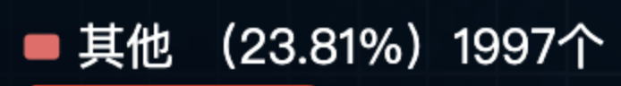

## echarts legend的formatter写法

[echarts官网文档中的formatter](https://echarts.apache.org/zh/option.html#legend.formatter)<br>
[echarts官网文档中的textStyle rich](https://echarts.apache.org/zh/option.html#legend.textStyle.rich)

在echarts官网中，对于**图例的formatter函数只有一个name属性**的使用，但是往往在实际开发当中，会有很多地方需要自定义图例的内容，比如：



遇到这种需求的时候，可以**用额外的盒子通过定位也能实现**，但是不是非常的优美，这时候就需要使用我们的**textStyle中的rich去实现**这个效果，代码如下：

```JS
let options = {
    legend: {
        icon: "rect",
        selectedMode: false, // 取消图例点击事件
        itemWidth: 10, // 图例颜色块的宽度和高度
        itemHeight: 10,
        data: ["其他"],
        formatter: function (name) {
            return (
                  "{name|" + name + "}" 
                  + 
                  "{percent|" + "(" + that.data.percent + ")" + "}" 
                  + 
                  "{value|" + that.data.value + "个" + "}"
                );
        },
        textStyle: {
            rich: {
                name: {
                    fontSize: 18,
                    color: "#FFF",
                    padding: 10
                },
                percent: {
                    fontSize: 18,
                    color: "#FFF"
                },
                value: {
                    fontSize: 18,
                    color: "#FFF"
                }
            }
        }
    }
}
```

大概就是这么个意思，数据方面只能曲线救国拿data的数据进行二次处理，**不能像tooltip那种直接通过formatter拿到数据**